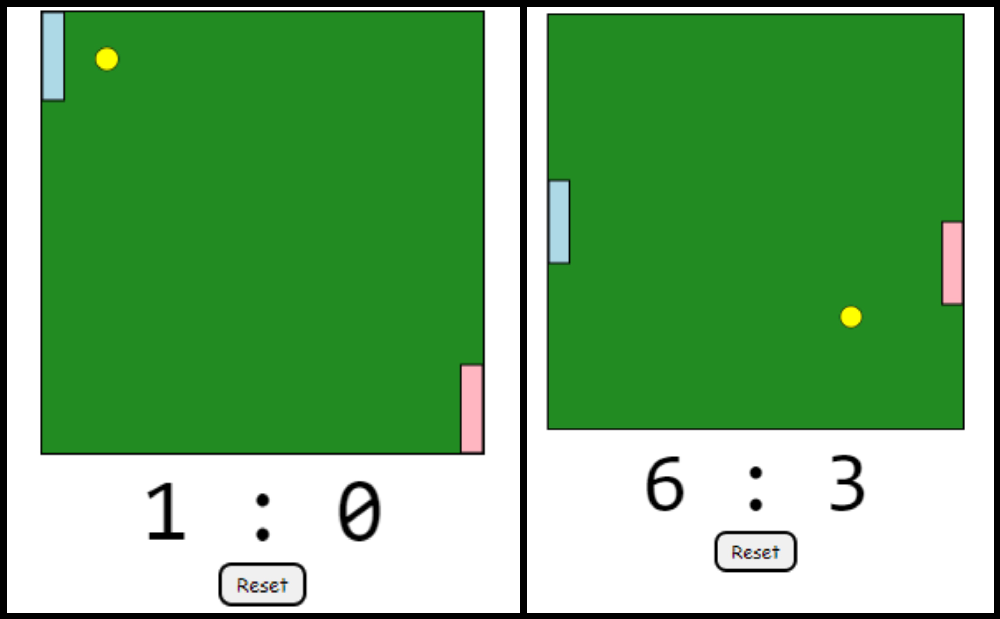

# HTML Pong Game

a classic Pong game implemented in HTML, CSS, and JavaScript. It serves as an entertaining game that features two paddles, a ball, and a score tracker.

## Game Details

- **Game Window:** Set to a width of 500 and a height of 500 pixels.
- **Game Speed:** Runs at a speed of 10 milliseconds per frame.
- **Space Size:** Each game square measures 50x50 pixels.
- **Paddle 1 Color:** Light blue.
- **Paddle 2 Color:** Light pink.
- **Paddle Border Color:** Black.
- **Ball Color:** Yellow.
- **Ball Border Color:** Black.
- **Ball Radius:** 12.5 pixels.
- **Paddle Speed:** Moves at a speed of 50 pixels per frame.

## How to Play
- Use the W and S keys for Player 1 to move the paddle up and down, respectively.
- Use the Up(^) and Down(v) arrow keys for Player 2 to move the paddle up and down, respectively.
- Score points by getting the ball past your opponent's paddle.

### HTML Structure

The HTML file comprises a canvas element for the game board, a score display, and a reset button.

### CSS Styling

Styles have been applied to the game container, game board, score text, and reset button.

### JavaScript (index.js)

- **Game Board Setup:** Constants are defined, and variables, including paddle and ball properties, are initialized.
- **Event Listeners:** Key events (arrow keys) control paddle movement, and a button click resets the game.
- **Game Initialization:** Functions are called to create the ball, start the game, and handle game ticks.
- **Game Loop (nextTick):** A game loop is established using setTimeout, responsible for clearing the board, updating paddles and the ball, checking collisions, and proceeding to the next frame.
- **Board Clearing (clearBoard):** The board is filled with a background color.
- **Paddle Drawing (drawPaddles):** Paddles are drawn with specified colors.
- **Ball Creation (createBall):** A new ball is generated with a random starting direction.
- **Ball Movement (moveBall):** The ball's position is updated based on speed and direction.
- **Ball Drawing (drawBall):** The ball is drawn on the canvas.
- **Collision Checking (checkCollision):** Collisions with walls and paddles are checked, and the score is updated accordingly.
- **Direction Change (changeDirection):** Paddle direction is updated based on arrow key inputs.
- **Score Update (updateScore):** The score display is updated.
- **Game Reset (resetGame):** The game is reset by reinitializing variables and restarting the game loop.

It is free to customize the game settings and styles to suit user preferences

---

This project served as a fun exercise in creating a classic Pong game using basic web technologies.

- Sophia
